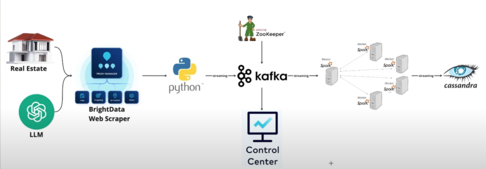

# Streaming Data Pipeline with AI Integration for Feature Extraction

## Project Overview
This project showcases a comprehensive streaming data pipeline specifically designed for real estate data. It employs web scraping techniques to gather property listings, processes the gathered data, and leverages the power of GPT-4 for feature extraction via a streaming architecture. The processed data is then stored in a distributed database, ready for subsequent analysis.



## Technologies Used
- Web Scraping: Selenium with undetected-chromedriver
- Data Extraction: GPT-4 for parsing HTML content
- Streaming: Apache Kafka with ZooKeeper
- Stream Processing: Apache Spark (Master-Worker architecture)
- Monitoring: Confluent Control Center
- Storage: Apache Cassandra
- Containerization: Docker and Docker Compose
- Programming Language: Python

## Methodology/Process

1. **Web Scraping**:
   - Use Selenium with undetected-chromedriver to bypass anti-bot measures on Zoopla.
   - Navigate through property listings and extract raw HTML content.

2. **Data Extraction**:
   - Utilize GPT-4 to parse the HTML content and extract relevant features from property listings.
   - Structure the extracted data into a consistent format.

3. **Data Streaming**:
   - Stream the extracted data to Apache Kafka topics.
   - Use ZooKeeper for distributed coordination of Kafka brokers.
   - Monitor the streaming process using Confluent Control Center.

4. **Data Processing**:
   - Implement a Spark streaming job with Master-Worker architecture.
   - Consume data from Kafka topics and apply necessary transformations.

5. **Data Storage**:
   - Store the processed data in Apache Cassandra for persistence and further analysis.

## Replication Guide

1. Clone the repository:

    ```bash
    git clone
    ```
2. Set up the environment:
   - Install Docker and Docker Compose
   - Create a `.env` file with necessary credentials (Zoopla API, GPT-4 API key, etc.)

3. Start the infrastructure:
    
    ```bash
    docker-compose up -d
    ```
4. Run the web scraper:
    
    ```bash
        main.py
    ``` 
5. Start the Spark Consumer:
    ```bash
    docker-compose exec spark-master spark-submit --packages org.apache.spark:spark-sql-kafka-0-10_2.12:3.1.2,com.datastax.spark:spark-cassandra-connector_2.12:3.1.0 spark-consumer.py
    ``` 
6. Monitor the process:
- Access Confluent Control Center at `http://localhost:9021`
- Check Cassandra data using `cqlsh` or a compatible GUI tool

Note: Ensure compliance with Zoopla's terms of service and implement appropriate rate limiting in your scraper.